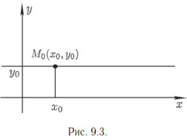
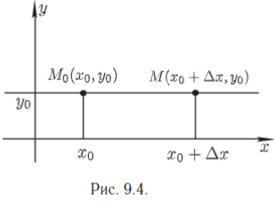
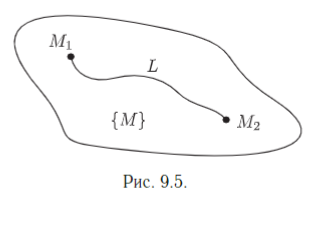

# Непрерывность функции многих переменных

Пусть функция 

$$u=f(M)$$

определена на множестве 

$\{M\}  \subset \R^m$ и пусть точка $A\; \in \{M\}$ и является 
предельной точкой множества $\{M\}$.
Определение. Функция $u=f(M)$ называется _непрерывной_ в точке A, если
$$
\lim_{M \to A} f(M) = f(A). (9.2)
$$
_Точка разрыва_ функции $u=f(M)$ - это предельная точка множества
{M}, в которой $f(M)$ не является непрерывной.

_Определение_. Приращением (полным приращением) функции $u=f(M)$ в точке A называется функция $\Delta u = f(M) - f(A)$. 
Условие (9.2) непрерывности функции в точке A можно записать в виде:
$$
    \lim_{M\to A} \Delta u = \lim_{M \to A}\Bigg[ f(M) - f(A) \Bigg] = 0. (9.3)
$$
Равенство (9.3) называется _разностной формой условия непрерывности функции в точке A._
Пусть точки M и A имеют координаты: $M(x_1,...,x_m)$ и 
$A(a_1,...,a_m)$. Положим $\Delta x_1 = x_1 - a_1,...,\Delta x_m = x_m - a_m$, тогда $x_1 = a_1 +\Delta x_1,...,x_m = a_m +\Delta x_m$.
$$
    \Delta u = f(M)-f(A) = f(a_1,+\Delta x_1,...,a_m+\Delta x_m) - f(a_1,...,a_m).
$$
Разностная форма условия непрерывности функции принимает вид
$$
    \lim_{\Delta x_1 \to \infty \\ ..... \\ \Delta x_m \to \infty} \Delta u=0.
$$

Введем теперь понятие _непрерывности функции по отдельным переменным_.
Рассмотрим функцию двух переменных $u=f(x,y)$. Зафиксируем значение аргумента y, положив $y=y_0$(рис.9.3). Получаем функцию одной переменной $f(x,y_0)$. Если эта функция непрерывна в точке $x_0$, то есть $\lim_{x\to x_0} f(x,y_0) = f(x_0,y_0)$, то будем говорить, что функция $u=f(x,y)$ непрерывна в точке $M_0(x_0,y_0)$ по переменной x.

Аналогично определяется непрерывность функции $f(x,y)$ в точке $M_0$ по переменной $y$.

Сформулируем другое (эквивалентное) определение. Из точки
$M_0(x_0,y_0)$ перейдем в точку $M(x_0+\Delta x,y_0)$, то есть дадим
Приращение $\Delta x$ аргументу x(рис.9.4). Функция $u=f(x,y)$ получит приращение
$$
    \Delta_x u = f(x_0 + \Delta x,y_0) - f(x_0,y_0).
$$
Оно является функцией одной переменной $\Delta x$ и называется _частным приращением_ функции $f(x,y)$ в точке $M_0$, соответствующим приращению $\Delta x$ аргумента x.

_Определение_. Функция $u=f(x,y)$ называется непрерывной в точке $M_0(x_0,y_0)$ по переменной x, если $\lim_{\Delta x \to 0} \Delta_x u = 0$.

Аналогично определяется непрерывность функции $u=f(x_1,...,x_m)$ в данной точке по отдельным переменным.
Непрерывность функции, определённую условием (9.2) (или 9.3), называют также _непрерывность_ по совокупности переменных.

_Теорема 6_. Если функция $u=f(x,y)$ определена в окрестности точки $M_0(x_0,y_0)$ и непрерывна в точке $M_0$, то она непрерывна в этой точке по отдельным переменным.
_Доказательство_. По условию $\lim_{x\to x_0 \\ y\to y_0} f(x,y) = f(x_0,y_0)$.  В частности, $\lim_{x\to x_0} f(x,y_0) = f(x_0,y_0)$, а это означает, что $f(x,y)$ непрерывна в точке $M_0$ по переменной x. Аналогично доказывается непрерывность в точке $M_0$ по переменной y.
_Замечание_. Обратное к теореме 6 утверждение не верно.

## Основные теоремы о непрерывных функциях

Теорема 7 (арифметические операции над непрерывными функциями). Если функции $f(M)$ и $g(M)$ определены на множестве $\{ M\}$ и непрерывны в точке A, то $f(M)\plusmn g(M)$, $f(M)g(M)$, $\frac{f(M)}{g(M)}$(при условии $g(A) \neq 0$) непрерывны в точке A.

Утверждение теоремы 7 следует из теоремы 4 и определения непрерывности.

Пусть аргументы функции $u =f(x_1,....,x_m)$ являются не независимыми переменными, а функциями переменных $t_1,...,t_k$:
$$
    x_1 = \phi_1(t_1,...,t_k),...,x_m = \phi_m(t_1,...,t_k) (9.4)
$$
причем функции (9.4) определены на множестве $\{\mathbb{K}(t_1,...t_k)\} \subset \R^k$.
В этом случае будем говорить что на множестве ${\mathbb{K}}$ определена _сложная функция_ $u=f(\phi(t_1,...,t_k)),...,\phi_m(t_1,...,t_k)$).
_Теорема 8_ (о непрерывности сложной функции). Пусть функции (9.4) непрерывны в точке $A (a_1,...a_k)$, а функция $u=f(x_1,...,x_m)$ непрерывна в точке $B(b_1,...,b_m)$. где $b_1 = \phi_1(a_1,...,a_k),...,b_m =\phi_m(a_1,...,a_k)$. Тогда сложная функция $u=f(\phi_1(t_1,...,t_k),...,\phi_m(t_1,...t_k))$ непрерывна в точке A.

_Теорема 9_ (об устойчивости знака непрерывной функции).
Если функция $u=f(M)$ непрерывна в точке $A$ и $f(A) > 0$(<0), то $\exist \delta$- окрестность точки A, в которой
$f(M)>0(<0)$.
Указание: для доказательства теоремы воспользуйтесь определением непрерывности функции в точке A и возьмите $\epsilon=|f(A)|$.

_Теорема 10_ (о прохождении непрерывной функции через любое промежуточное значение). Пусть функция $u=f(M)=f(x_1,...,x_m)$ непрерывна на связном множестве $\{M\}$, пусть $M_1$ и $M_2$ - две любые точки из $\{M\}$, $f(M_1) = u_1$, $f(M_2) = u_2$, и пусть $u_0$- любое число из сегмента $[u_1,u_2]$.
Тогда из любой непрерывной кривой $L$, соединяющей точки
$M_1$ и $M_2$ и целиком принадлежащей множеству $\{M\}$, найдется такая точка $M_0$, такая, что $f(M_0)=u_0$.
_Доказательство_. Пусть 
$$
    L=\{M(x_1,...,x_m):x_1=\phi_1(t),...,x_m=\phi_m(t),\alpha \leq t \leq \beta\}
$$- непрерывная кривая, соединяющая точки $M_1$ и $M_2$ и целиком принадлежащая множеству $\{M\}$ (рис. 9.5).

Точки $M_1$ и $M_2$ имеют координаты: $M_1(\phi_1(\alpha),...,\phi_m(\alpha))$, $M_2(\phi_1(\Beta),...,\phi_m(\Beta))$.

На кривой L заданная функция является сложной функцией переменной t:
$$
    u=f(\phi_1(t),...,\phi_m(t))=:F(t)
$$,
причем по теореме 8 функция $F(t)$ непрерывная на сегменте $[\alpha,\beta]$. На концах сегмента $[\alpha,\beta]$ функция $F(t)$ имеет значения $F(\alpha) = f(\phi_1(\alpha),...,\phi_m(\alpha))=f(M_1)=u_1$ и $F(\beta) = f(M_2) = u_2$.

В силу известной теоремы для функции одной переменной 
$\forall u_0 \in [u_1,u_2] \exist t_0 \in [\alpha,\beta]$, такое, что $F(t_0) = u_0$. Но $F(t_0) = f(\phi_1(t_0),...,\phi_m(t_0)) = f(M_0)$, причем точка $M_0(\phi_1(t_0),...,\phi_m(t_0))\in L$.

Итак, $\exist$ точка $M_0 \in L: f(M_0) = u_0$, что и требовалось доказать.
Для доказательства следующих трёх теорем (первой и второй теорем Вейерштрасса и теоремы Кантора) нам понадобится
_Лемма 3_. Пусть {$M$} - замкнутое множество и пусть последовательность точек {$M_n$} $\to$ $A$, причем все $M_n \in${$M$}. Тогда $A \in \{ M\}$.
_Доказательство_. Так, как {$M_n$} $\to A$, то в любой $\epsilon$ - окрестности точки A содержатся члены последовательности {$M_n$}. Тем самым, в любой $\epsilon$-окрестности точки A содержатся точки из множества {$M$}. Поэтому точка A - либо внутренняя точка множества {$M$}, и тогда она принадлежит этому множеству как и всякая внутренняя точка, либо $A$- граничная точка множества {$M$}, и тогда она принадлежит {$M$}, так как множество {$M$} - замкнутое множество (то есть содержит все свои граничные точки). Таким образом, в любом случае $A\in \{M\}$. Лемма 3 доказана.
_Замечание_. Это утверждение аналогично следующему утверждению для одномерного случая: если все $x_n \in [a,b]$ и {$x_n$} $\to \epsilon$, то $\epsilon \in [a,b]$. 

_Определение_. Функция $u=f(M)$ называется _ограниченной_ на множестве $\{M\}$, если $\exist$ числа $C_1 и C_2$, такие, что $\forall M \in \{M\}:C_1 \leq f(M) \leq C_2$.

_Теорема 11_ (первая теорема Вейерштрасса). Если функция $u=f(M)$ непрерывна на _замкнутом ограниченном_ множестве {M}, то она ограничена на этом множестве.

_Доказательство_. Допустим, что $u=f(M)$ не ограничена на множестве {$M$}. Тогда $\forall$ натурального числа n$\exist M_n \in {$M$}:|f(M_n)| > n$. Тем самым последовательность {$f(M_n)$} - бесконечно большая. Из ограниченной последовательности точек {$M_n$} можно выделить сходящуюся подпоследовательность. Пусть подпоследовательность {$M_{k_n}$} $\to A$. В силу леммы 3 точка $A \in \{M\}$ и поэтому функция $f(M)$ непрерывна в точке A. Следовательно, {f(M_{k_n})} $\to f(A)$, а это противоречит тому, что {$f(M_{k_n})$} -бесконечно большая последовательность.
Полученное противоречие доказывает, что наше предположение не верно и, следовательно, функция $u=f(M)$ ограниченна на множестве {$M$}.
_Замечание_. Если множество {$M$} не является ограниченным или не является замкнутым, то непрерывная на таком множестве функция $u=f(M)$ может быть неограниченной на этом множестве.

_Определение_. Число U называется _точной верхней гранью_ функции $u=f(M)$ на множестве {$M$}, если 
1: $\forall M \in \{ M\}:f(M) \leq U$;
2: $\forall\ числа\ \widetilde{U}<U\exist \widetilde{M} \in \{M\}:f(\widetilde{M}) > \widetilde{U}$.
_Обозначение_: U = \sup_{\{M\}}f(M),
Аналогично определяется точная нижняя грань функции $\int_{\{M\}}f(M)$.

_Теорема 12_ (вторая теорема Вейерштрасса). Непрерывная на замкнутом ограниченном множестве функция достигает на этом множестве своих точных нижней и верхней граней.

Теорема доказывается так же, как и аналогичная теорема для функции одной переменной.

_Определение_. Функция $u=f(M)$ называется _равномерно непрерывной_  на множестве {$M$}, если $\forall \epsilon > 0 \exist \delta >0$(зависящее только от $\epsilon$), такое, что $\forall M_1$ и $M_2$ из множества {$M$}, удовлетворяющих условию $\rho(M_1,M_2)<\delta$, выполняется неравенство
$$
    |f(M_1) - f(M_2)| < \epsilon.
$$

Теорема 13 (Кантора) Непрерывная на замкнутом ограниченном множестве функция равномерно непрерывна на этом множестве.
Теорема доказывается так же, как и для функции одной переменной.