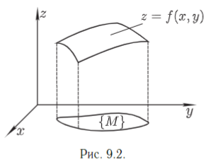

# Понятие функции многих переменных. Предел функции многих переменных.

Пусть $\{M(x_1,...,x_m)\}$ - множество точек пространства $\R^m$
и пусть каждой точке M из этого множества поставлено в
соответствие некоторое число $u$. Тогда говорят, что на множестве $\{M}\$ определена _функция $m$ переменных_.
_Обозначения_: $u=f(x_1,...,x_m)$ или $u=f(M)$.

Множество $\{M\}$ называется _областью определения_
функции, а координаты $x_1,...,x_m$ - независимыми
переменными (или аргументами фукнции). Множество
значений функции будем обозначать $\{u\}$.
В случае функции двух переменных будем использовать 
обозначения $u=f(x,y)$ или $z=f(x,y)$. График функции двух переменных $z=f(x,y)$ - поверхность в прямоугольной системе координат $Oxyz$, точки которой имеют координаты
$(x,y,f(x,y))$.(рис.9.2).

Пусть функция $u=f(M)$ определена на множестве {M} и точка A - предельная точка множества {M}.
**Определение 1 (по Коши).** Число b называется _пределом_ функции $u=f(M)$ в точке A (при $M\ \to\ A$),
если $\forall\ \epsilon\ >\ 0\ \exist\ \delta\ >\ 0$,
такое, что $\forall\; M \in {M}$, удовлетворяющей условию $0 < \rho(M,A) < \delta$, выполняется неравенство $|f(M) - b|<\epsilon$.
**Определение 2 (по Гейне)**. Число b называется _пределом_ функции $u=f(M)$ в точке A (при $M\toA$), если $\forall \{M_n\} \to A (M_n \in \{M\},M_n \neq A)$ соответствующая последовательность
$\{f(M_n)\} \to b$.

_Обозначения_: $\lim_{M\to A} f(M) = b$ или $\lim_{x_1 \to a_1}f(x_1,...,x_m)=b$, где $A=A(a_1,...,a_m)$.
Теорема 3. Определения 1 и 2 эквивалентны.
Доказательство проводится так же, как и для функции одной переменной.

Теорема 4. Если функция $f(M)$ и $g(M)$ определены на множестве {M} и существуют пределы $\lim_{M\toA} f(M) = b$, $\lim_{M\toA} g(M) = c$, то существуют пределы
$$
    \lim_{M \to A} \Bigg [ f(M) \plusmn g(M) \Bigg ] = b \plusmn c, \; \lim_{M \to A} f(M) g(M) = bc,
$$
и если $c = 0$, то существует $\lim_{M \to A} \frac{f(M)}{g(M)} = \frac{b}c$.
Доказательство теоремы проводится так же, как и доказательство аналогичной теоремы для функций одной переменной.
Пусть точка A - предельная точка области определения функции $f(M)$.
_Определение_. Говорят, что функция $f(M)$ удовлетворяет в точке A условию Коши, если $\forall \epsilon > 0 \exist \delta >0$, такое, что для любых точек $M_1$ и $M_2$ из проколотой $\delta$ - окрестности точки A(при этом точки $M_1$ и $M_2$ берутся из области определения функции $f(M)$) выполняется равентсво
$$
    |f(M_2) - f(M_1)| < \epsilon.
$$

Теорема 5 (Критерий Коши существования функции в данной точке). Для того, чтобы функция $f(M)$ имела предел в точке A, необходимо и достаточно, чтобы она удовлетворяла в этой точке условию Коши.

Определение (по Коши). Число b называется пределом функции $f(M)$ при $M \to \infty$, если $\forall \epsilon >0 \exist R >0$, такое, что для любой точки M из множества $\{M\}$, удовлетворяющей условию $\rho(M,O) > R$, выполняется неравенство
$$
    |f(M) - b| < \epsilon.
$$
_Обозначение_: $\lim_{M\to \infty} f(M) = b$ или $\lim_{x_1 \to \infty \\..... \\ x_m \to \infty} = b$.