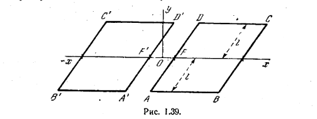

# Конформные отображения

## Определение

Дана аналитическая функция $Z=f(z)$. Если точка m с аффиксом $z=x+iy$ описывает кривую $\gamma$ в плоскости z, то точка M  с аффиксом $Z=X+jY$ описывает кривую $\Gamma$ в плоскости Z 
  
(рис 1.36). Кривая $\Gamma$ называется образом кривой $\gamma$; точки M и m называются соответствующими. Основное свойство этого преобразования состоит в том, что оно сохраняет углы и, следовательно, вид бесконечно малых элементов. Поэтому, оно называется конформным (conforme - подобный).

Действительно, пусть m, $m^\prime$ - две соседние точки на кривой $\gamma$, а M и $M^\prime$ - две соответствующие точки на кривой $\Gamma$. Если обозначить через
$\phi$ и $\Phi$ углы между mm^\prime и Ox и между MM^\prime и OX, то 
$$
    \Delta z = mm^\prime e^{j \phi}, \Delta Z = MM^\prime e^{j \phi}, \frac{\Delta Z}{\Delta z} = e^{ j( \Phi - \phi ) } \frac{ MM^{`} }{ mm^{`} }
$$

В этих формулах $mm^\prime$ и $MM^\prime$ означают длины соответствующих отрезков.
Если $m^\prime$ стремится к m, то $M^\prime$ будет стремиться к M. Можно показать что при этом отношение длин $\frac{MM^\prime}{mm^\prime}$ стремится к $|f^{`}(z)|$, а угол поворота $(\Phi - \phi)$ - к аргументу производной функции $f(z)$. Таким образом,
$$
    dZ = e^{j arg f^\prime (z)}|f^\prime (z)| dz.
$$

Это означает, что при конформном отображении элемент dz удлиняется в $|f^\prime (z)|$ раз и поворачивается на угол $arg f^\prime (z)$. Такое же преобразование испытывает любой бесконечно малый элемент комплексной плоскости.

Если $\gamma_1$ и $\gamma_2$ - две кривые в плоскости z, проходящие через точку z и образующие друг с другом некоторый угол, то такой же угол по величине и по знаку образуют между собой образы этих кривых $\Gamma_1$ и $\Gamma_2$. Проведенные рассуждения перестают быть верными в точках, где производная равна нулю или где её модуль бесконечен. Действительно, рассмотрим, например, функции $Z = kz^n (n>1) и Z=\frac{k}{z}$ (см. случаи а и г п 1.4.2). Две прямые, проходяшие через начало координат и образующие между собой угол $\phi$ преобразуются в плоскости $Z$ в две прямые, образующие между собой угол $n\phi$ (случай a) и - $\phi$ (случай д). В первом примере модуль производной в начале координат равен нулю, во втором - бесконечности.

Отделяя в равенстве Z=f(z) вещественные и мнимые части, получим $Z=X+jY = f(x+jy) = X(x,y) + jY(x,y)$.

Если точка z описывает кривые $X(x,y) = const\text{ или }Y(x,y) = const$ в плоскости z, то точка Z описывает прямые параллельные осям OY. OX (рис.1.37). Следовательно в силу сохранения углов кривые $X(x,y) = const$

и $Y(x,y) = const$ ортогональны. X(x,y) и Y(x,y) - вещественная и мнимая части $f(z)$ - называются сопряженными функциями.

Части бывает проще рассмаотривать не $Z = f(z)$, а обратное преобразование $z=F(z)$. Приравнивая вещественную и мнимую части, получаем
$$
    x = x(X,Y),
    y = y(X,Y)
$$

В этом случае кривые, которые преобразуются в прямые, параллельные осям OX, OY, задаются в параметрической форме: *Y* фиксировано, X меняется или X фиксировано, Y меняется.

Исключая из обоих равенств последовательно X и Y, получим соответственно
$$
    g(x,y,Y)=0, h (x,y,X) = 0
$$

уравнения семейств кривых, преобразующихся в параллели осям OX и OY, причем Y и X играют здесь роль параметров, фиксирующих конкретную кривую.

Из аналитичности $f(z)$ следует (см п. 1.3.3), что

$$
\frac{\partial^2 X}{\partial x^2} + \frac{\partial^2 X}{\partial y^2} = 0\\ 
\\ 
\frac{ \partial^2 Y}{\partial x^2} + \frac{\partial^2 Y}{\partial y^2} = 0
$$

Таким образом, функции X(x,y) и Y(x,y) - гармонические, причем семейства X(x,y) = const и Y(x,y) = const ортогональны в плоскости Z.

Отметим, что задача отыскания функции $Z = f(z)$. отображающей кривую $y=\phi(x)$ плоскости z в прямую, параллельную какой-ниюудь оси плоскости Z, в общем случае не решается. Поэтому обычно приходится ограничиваться заранее известными конформными отображениями, используя ортогональные семейства двухмерных гармонических функций (например, отображения при помощи комбинаций элементарных функций). Эта задача отыскания ортогональных семейств двухмерных гармонических функций возникает при рассмотрении различных плоских полей.

Примеры: 
1) Отыскание силовых и эквипотенциальных линий электростатического или магнитного плоского полей;

2) отыскание линий теплового потока и изотерм нагретого тела;
3) отыскание линий равного потенциала скорости и линий тока плоского установившегося движения жидкости;
4) отыскание линий электрического тока и эквипотенциальных линий в проводнике и т.д.

Рассмотрим подробнее случай электростатики. Пусть даны два проводящих тела, помещенных в идеальный диэлектрик. Их потенциалы соответственно $V_1$ и $V_2$. Основная задача в этом случае состоит в определении конфигурации возниккшего электростатического поля и величины заряда на каждом из проводников. Известно, что эта задача сводится к отысканию решения уравнения Лапласа, т.е к отысканию гармонической функции, которая принимает заданные величины $V_1$ и $V_2$ на поверхности проводников.

Если проводники представляют собой два цилиндра с параллельными осями, продольные размеры которых велики по сравнению с поперечными, то изучая распределение поля в поперечном сечении средней части проводников, можно пренебречь краевыми эффектами. Таким образом мы приходим к плоской задаче.

Если мы найдем конформное отображение, приводящее поперечные сечения цилиндров, изображенные в плоскости z, в соответствие с параллелями $X=V_1$, $X=V_2$, изображенными в плоскости Z. иначе говоря,  если нам удастся задать оба этих поперечных сечения в качестве представителей некоторого семейства гармонических функций, то прямые $Y = const$ и $X=const$ являются соответственно образами электростатических силовых и эквипотенциальных линий, расположенных в плоскости z. В частности к эквипотенциальным линиям относятся и поперечные сечения данных цилиндров, значения потенциалов на которых как раз равны $V_1$ и $V_2$.

И обратно: если задано какое-либо конформное отображение $Z = f(z)$, то с помощью функции X(x,y), Y(x,y) можно решить соответствующую электростатическую задачу. Мы уже отмечали, что вычисления в этом случае гораздо проще, чем в предыдущем. Выражения X(x,y)=const и Y(x,y)=const представляют собой уравнения эквипотенциальных и силовых линий.

Остаётся определить плотность заряда $\sigma$ и величину заряда q проводника. Пусть E-вектор электрического поля; он является градиентом скалярного потенциала. Если принять функцию X(x,y) за потенциальную функцию то (n. 3.2.16)
$$
    E = -grad\ X(x,y).
$$

Обозначим через $\epsilon$ диэлектрическую проницаемость среды. Известно, что поверхностная плотность электрического заряда $\sigma$ равна произведению $\epsilon$ на модуль вектора E в рассматриваемой точке поверхности проводника.

Так как этот вектор нормален к поверхности, то 
$$
    \sigma = -\epsilon \frac{\partial X}{\partial n}
$$

как в силу ортогональности кривых X и Y будет 
$$
    \sigma = \epsilon \frac{\partial Y}{\partial s}
$$

Рассмотрим элемент нашей цилиндрической поверхности, имеющий высоту единица и стягиваемый дугой длиной $ds$. Заряд, носимый этим элементом, равен 
$$
    dq = \sigma ds = \epsilon dY
$$

Заряд участка поверхности единичной высоты, опирающегося на дугу AB поперечного сечения цилиндра, равен
$$
    q_{AB} = \epsilon \int_{A}^{B} dY = \epsillon (Y_{B} - Y_{A}).
$$

Заряд единицы длины одного из цилиндров (единичный заряд), который мы определим, если совершим полный поворот вокруг соответствующего поперечного сечения, равен с точностью до коэффициента $\epsilon$ приращению функции Y. Если цилиндр заряжен, эта функция, очевидно, неоднозначна.

В нижеследующих примерах обе функции X и Y взаимно заменяемы и одна из них, в зависимости от условий, играет роль функции потенциала.

*Пример*. Рассмотрим преобразование $Z = arch \frac{z}{d}$ т.е. $z = d\ ch\ Z.$
Имеем
$$
    x = d\ ch\ X\ cos\ Y. y = d\ sh\ X\ sin\Y
$$

Если считать X постоянным, то в плоскости z получаем кривую

$$
    \frac{x^2}{d^2\ ch^2\ X} + \frac{y^2}{d^2\ sh^2\ X} - 1 = 0
$$

Если считать Y постоянным, то в плоскости z получаем кривую
$$
    \frac{x^2}{d^2 cos^2 Y} - \frac{y^2}{d^2 sin^2 Y} - 1 = 0
$$

Эти кривые образуют ортогональные семейства эллипсов и софокусных гипербол с фокусами $F^{\`} и F^{\`}$ отстоящими друг от друга на расстоянии 2d.

Рассмотрим эллипсы и гиперболы соответственно как эквипотенциальные и силовые линии некоторого плоского электростатического поля. В пространстве эквипотенциальные поверхности предстаавляют собой эллиптические цилиндры. Поперечное сечение их изображено на рис. 1.38.

Ничего не меняя в распределении поля, можно материализовать одну из этих поверхностей в виде проводника определенного потенциала. Таким образом, мы определим силовые линии и поперечное сечение эквипотенциальных поверхностей для наэликтризованного эллиптического цилиндра.

В частном случае $X=0$ наш цилиндр вырождается в плоскую ленту шириной 2d. Указанные выше формулы позволяют и для этого проводника определить силовые линии и эквипотенциальные поверхности.

Ничего не меняя в распределении поля, можно материализовать одну из этих поверхностей в виде проводника определенного потенциала. Таким образом, мы определим силовые линии и поперечное сечение эквипотенциальных поверхностей для наэлектризованного эллиптического цилиндра.

В частном случае $X=0$ наш цилиндр вырождается в плоскую ленту шириной 2d. Указанные выше формулы позволяют и для этого проводника определить силовые линии и эквипотенциальные поверхности. 

Определим емкость еддиницы длины передающего кабеля, у которого внутренний и внешний проводники представляют собой соответственно ленту и эллиптический цилиндр. Если через a и b обозначить полуоси эллипса, то $a^2-b^2 = d^2$. При обходе вокруг одного из проводников функция Y изменяется на $2 \pi$. Следовательно искомая единичная емкость C будет равна.
$$
    C = \frac{2 \pi \epsilon}{|X_1 - X_2|}.
$$

где $X_1$ и $X_2$ - соответствующие потенциалы ленты и цилиндра. Поскольку $X_1 = 0, a ch X_2$ - соответствующие потенциалы ленты и цилиндра. Поскольку $X_1 = 0, а ch X_2 = \frac{a}{d}, для C получим

$$
    C = - \frac{2 \pi \epsilon}{arch \frac{a}{d}} = \frac{2 \pi \epsilon}{ln (a + b) - ln d}
$$

Рассмотрим теперь случай, когда гиперболы - эквипотенциальные линии а эллипсы - силовые линии. На рис. 1.38 изображены эти линии, вызванные в данном случае электрическим полем, возникающим между двумя поверхностями гиперболического цилиндра, наэлектризованными до определённого потенциала. Рассмотрим, в частности, вырожденный гиперболический цилиндр, соответствующий тем значениям Y, которые обращают в нуль $sin\ Y$. Он сводится к двум полуплоскостям, разделённым разрезом шириной в 2d. Ограничим эти полуплоскости прямыми, перпендикулярными F\`F, на расстоянии l от неё (рис. 1.39). Конечно, чтобы не возмущать поле, остальная часть каждой полуплоскости должна обладать тем же потенциалом, но по контурам ABCD и A`\B\`C\`D\` отделяться от обоих прямоугольников очень узким промежутком (охранным кольцом). Найдём емкость конденсатора, образованного указанными прямоугольниками.

Заряд одного прямоугольника равен
$$
    Q = 2l \epsilon [X]^{x=x}_{x=d} = 2 l \epsilon [arch\frac{x}{d}]^x_d,\\ 
    Q = 2l \epsilon ln (\frac{x}{d} + \sqrt{\frac{x^2}{d^2} - 1}).
$$

Потенциал одной полуплоскости соответствует Y = 0, потенциал другой - Y = $\pi$. Следовательно, искомая емкость равна
$$
    C = \frac{2 l \epsilon}{\pi} ln(\frac{x}{d} + \sqrt{\frac{x^2}{d^2} -1})
$$

Вернёмся к рис 1.38 и причём $Y = \frac{\pi}{2}$. Гиперболический цилиндр сведется в этом случае к плоскости, перпендикулярной прямой F`F/ Следовательно риc. 1.38 представляет также силовые линии и линии уровня системы, образованной плоскостью и перпендикулярной ей полуплоскостью, разделёнными разрезом шириной в d