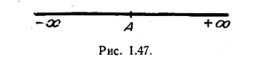
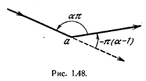
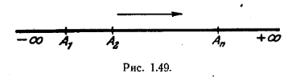

# Отображение Шварца.

Рассмотрим функцию $(Z-A)^{n-1}$, где A - вещественное число, а a -число, меньшее единицы.
Введем функцию z удовлетворяющую дифференциальному уравнению
$$
    \frac{dz}{dZ} = (Z-A)^{n-1}
$$

Предположим, что точка Z пробегает ось Y=0 плоскости Z (рис. 1.47). Найдем кривую, которую описывает соответствующая точка плоскости z.
Если точка X расположена левее точки A, то аргумент отрицательного числа X-A равен $\pi$. Если точка X правее точки A, то аргумент положительного числа X - A равен нулю. Следовательно, аргумент числа $(X-A)^{n-1}$

будет скачкообразно изменяться на $-\pi(a-1), когда X пробегает прямую Y=0. Точка z при этом опишет две полупрямых, образующих между собой такой же угол $-\pi(a-1)$ в плоскости z, ибо
$$
    arg \frac{dz}{dZ} = arg \frac{dx + jdy}{dX} = arctg \frac{dy}{dx}
$$

соответственно внутренний угол между этими прямыми равен $\pi a$(рис.1.48).
Ясно, что точке A в рассматриваемом отображении соответствует точка а.

Рассмотрим теперь замкнутый многоугольник с внутренними углами
$$
    \pi a_1, \pi a_2 ,..., \pi a_n
$$

Из рассуждений, приведенных выше, вытекает, что с помощью преобразования
$$
    \frac{dz}{dZ} = (Z-A_1)^{a_1 -1} (Z-A_2)^{a_2 -1}...(Z-A_n)^{a_{n-1}}
$$
осуществляется отображение оси Y = 0 на многоугольник плоскости z с углами при вершинах, равными $\pi a_1, \pi a_2,..., \pi a_3$.

Величины $A_1$,....,$A_n$ (A_1 < ... < A_n), соответствующие различным вершинам многоугольника, подлежат определению. В силу замкнутости многоугольника значения $a_1,...,a_n$ связаны между собой равенством 
$$
    \pi a_1 + ... + \pi a_n = \pi(n-2)
$$

или 

$$
    \sum (a_n - 1) = -2 (16)
$$

Рассмотрим точку X(Y=0), перемешающуюся по вещественной оси плоскости Z от $-\infty$ до $A_1$. Согласно (16) можно принять, что для этих Z аргумент величины 
$$
    (X-A_1)^{a_1 -1}(X-A_2)^{a_2-1}...(X-A_n)^{a_n - 1}
$$
равен нулю. Тогда точка z будет перемещаться по вещественной оси плоскости z от точки $a_0$, соответствующей $X = - \infty$. Положение точки $a_0$ зависит от постоянной интегрирования уравнения
$$
    \frac{dx}[dX] = (X-A_1)^{a_1 -1} (X-A_2)^{a_2-1}...(X-A_n)^{a_n -1}
$$

Пусть точкам $A_k(k=1,...,n)$ вещественной оси плоскости Z(рис. 1.49) соответствуют точки $a_k$ плоскости z, являющиеся вершинами рассматриваемого многоугольника, а точка X продолжает перемащаться вдоль вещественной оси плоскости Z. При переходе точки X через $A_1$ аргумент правой части выписанного выше дифференциального уравнения изменится на $- \pi (a_1 -1)$. Соответственно этому при переходе через $a_1$ аргумент z, равный до этого нулю, также получает приращение $-\pi (a_1 -1)$, т.е. в $a_1$ точка переходит с вещественной оси плоскости z на прямую, образующую с этой осью внутренний угол $\pi a_1$ (ср. рис. 1.48). Совершенно аналогично

при переходе точки X через $A_2$ аргумент z получает приращение $-\pi(a_2-1)$
и точка z переходит в $a_2$ на новую прямую, образующую с прежней угол $\pi a_2$ и т.д.

Следовательно, точка z описывает ломанную линию с углами при вершинах $a_1, a_2,...,a_k$, измеряемыми в полуокружностях. Эта ломанная линия образует замкнутый многоугольник. Действительно, когда точка X пробегает отрезок от точки $A_n$ до $\infty$, точка z описывает прямую, образующую с положительными направлением вещественной оси угол $- \pi \sum (a_n - 1) = 2 \pi,$ т.е. крайние сотороны ломанной линии параллельны вещественной оси плоскости z.

Остается определить числа $A_1,...,A_n$, так, чтобы они действительно являлись образами вершин заданного многоугольника. Это обстоятельство составляет главную трудность при практическом использовании отображения Шварца. Доказывается, что можно произвольно выбрать образы трёх вершин многоугольника (т.е. три числа из $A_1,....,A_n$), а остальные числа $A_k$ определяются единственным образом. Рассмотрим способ их отыскания. Пусть задан многоугольник с вершинами $a_1,....,a_n$. Через вершины $a_n и a_1$ проводим вещественную ось плоскости z. Пусть углы при вершинах многоугольника $\pi a_1,... \pi a_n$. Тогда искомое преобразование имеет вид
$$
    z = k \int_{z_0}^Z (Z - A_1)^{a_1 - 1} ... (Z-A_n)^{a_n - 1} dZ.
$$

Число $Z_0$ и три числа из $A_1,...,A_n$ выбираются произвольно. Число k и n-3 числа из $A_1,...A_n$ следует выбрать таким образом, чтобы стороны получаемого многоугольника были равны сторонам данного многоугольника; n-3 числа A определяются через интегралы. Трудностью вычислений быстро возрастает с числом сторон. Однако в физике отображение Шварца очень редко применяется к многоугольникам с числом сторон, большим 4.
Легко заметить, что преобразование Шварца отображает верхнюю полуплоскость Z на внутренность многоугольника плоскости z, тогда как нижняя полуплоскость Z соответствует внешности многоугольника плоскости z.