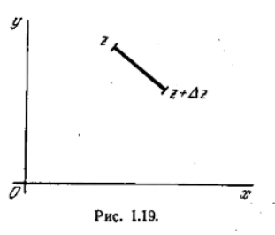

# Аналитическая функция

Производная однозначной функции (или одного из её значений, если функция многозначна) определяется как придел
$$
    \lim_{\Delta x \to 0} \frac{f(z+ \Delta z) - f(z)}{\Delta z}
$$

Если такой предел существует и не зависит от того, каким образом $\Delta z$ стремится к нулю, то говорят, что функция $f(z)$ аналитическая.

Изучим подробнее условие независимости стремления $\Delta z$ к нулю (рис. 1.19) Пусть
$$
    f(z) = P(x,y) + jQ(x,y)
$$
Дадим z приращение $\Delta z$; тогда функция f получит приращение $\Delta f$. Можно написать
$$
    \frac{\Delta f}{\Delta z} = \frac{\Delta P + j \Delta Q}{\Delta x + j \Delta y}
$$

Заменяя $\Delta P$ и $\Delta Q$ их дифференциалами и переходя к пределу, получим
$$
    \frac{df}{dz} = \frac{ (\frac{\partial P}{\partial x} + j \frac{\partial Q}{\partial x})dx + (\frac{\partial P}{\partial y} + j \frac{\partial Q}{\partial y})dy }{dx + jdy}
$$

Для независимости этого предела от способа стремления $\Delta z$ к нулю, т.е. от ориентировки малого отрезка $dz=dx+jdy$, нужно, чтобы это отношение не зависело от $\frac{dy}{dx}$. Последнее обстоятельство имеет место, если коэффициенты при $dx$ и $dy$ в числителе пропорциональны соответствующим коэффициентам в знаменателе, т.е.

$$
    \frac{ \frac{\partial P}{\partial x} + j\frac{\partial Q}{\partial x}}{i} = \frac{\frac{\partial P}{\partial y} + j\frac{\partial Q}{\partial y}}{j}
$$

Отсюда вытекают условия, которые называются условиями Коши - Римана:
$$
    \frac{\partial P}{\partial x} = \frac{\partial Q}{\partial y}\text{ и }\frac{\partial P}{\partial y} = - \frac{\partial Q}{\partial x}
$$

Эти условия необходимы для аналитичности функции. Они будут достаточными, если дополнительно потребовать непрерывность частных производных функций P и Q^{*}.

Дифференцируя полученные два уравнения и приравнивая смешанные производные, имеем
$$
    \frac{\partial^2 P}{ \partial x^2} + \frac{\partial^2 P }{\partial y^2} = 0.\\ \\ 

    \frac{\partial^2 Q}{\partial x^2} + \frac{\partial ^2 Q}{\partial y^2} = 0
$$

Следовательно, вещественная и мнимая части аналитической функции удовлетворяют уравнению Лапласа. Отметим, что последние условия недостаточны для аналитичности функции, так как не всякая пара решений уравнения Лапласа удовлетворяет условиям Коши - Римана.

Существует удобный критерия для проверки аналитичности функции.
Функция комплексной переменной аналитична, если она являясь по форме функцией двух независимых переменных x и y, фактически зависит только от их комбинации $x + jy$, т.е. является функцией одной независимой переменной z. Легко убедиться, что это требование эквивалентно выполнимости условий Коши - Римана. В самом деле, если в выражении
$$
    P(x,y) + jQ(x,y)
$$
заменим x на z - jy и полученную функцию переменных z и y частным образом продифференцируем по y, то находим
$$
    \frac{ \partial P}{\partial x} \frac{\partial x}{\partial y} + \frac{\partial P}{\partial y}

    + j ( \frac{\partial Q}{\partial x} \frac{\partial x}{\partial y} + \frac{\partial Q}{\partial y} )
$$
т.е.
$$
    \frac{ \partial P}{\partial y} + \frac{\partial Q}{\partial x} + j ( \frac{\partial Q}{\partial y} - \frac{\partial P}{\partial x})
$$

Если функция аналитическая, то это выражение тождественно равно нулю. Таким образом, полученная ранее функция переменных z и y не зависит от y, т.е. является функцией одного z. Обратное очевидно.

Отсюда следует, что дифференцируемая функция $\phi (t)$ вещественной переменной t, рассматриваемая как функция $\phi (x+jy)$, - аналитическая. Например, $x+2jy$ - не аналитическая функция, $x^2-y^2+2jxy = z^2$ аналитическая.