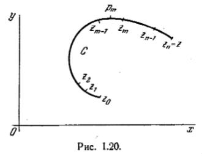

# Криволинейный интеграл от функции комплексной переменной

Пусть $f(z)$ - функция комплексной переменной z, С- непрерывная кривая, а $z_0 и z$ - аффиксы концов этой кривой. Разделим кривую на произвольное число частей с помощью промежуточных точек $z_1,z_2,...,z_{n-1},z_n = z$

Пусть $p_m$ - точка, находящаяся между $z_{m-1}$ и $z_m$. Отрезок, началом которого является $z_{m-1}$, а концом $z_m$ обозначим через $\Delta z_m$.

Рассмотрим сумму
$$
    S_n = \sum^{n}_{m=1} f(p_m) \Delta z_m
$$

Устремим n к бесконечности при условии, что наибольшее $|\Delta z_m|$ стремится к нулю.

Если при этом сумма $S_n$ имеет предел, не зависящий от выбора промежуточных точек, то этот предел называется криволинейным интегралом функции f(z) вдоль кривой C. Он обозначается так:
$$
    \int_{C} f(z)dz.
$$

Величина этого интеграла зависит не только от f(z), но и от формы кривой C.

Предположим, что длина кривой C конечна и равна s и что на кривой модуль $f(z)$ не превосходит постоянной M. Тогда справедлива оценка
$$
    |\int_{C} f(z) dz| \leqslant M_s
$$

В самом деле,

$$
    |\int_{C} f(z) dz| \leqslant M lim_{n \to \infty} \sum_{m=1}^n | \Delta z_m |
$$
но
$$
    lim_{n \to \infty} \sum_{m=1}^{n} | \Delta z_m |
    = \int_C |dz| = \int_C \sqrt{dx^2 + dy^2} = s.
$$
что и доказывает оценку.

Если разложить f(z) и dz на их вещественную и мнимую части 
$$
    f(z) = P(x,y) + j Q(x,y), dz = dx + jdy
$$

то получим

$$
    (5)    \int_C f(z) dz = \int_C (Pdx - Qdy) + j \int_C (Pdy + Qdx).
$$

Как указано выше, интеграл, определённый таким образом, зависит не только от положения концов кривой C, но и вообще говоря, от формы этой кривой.