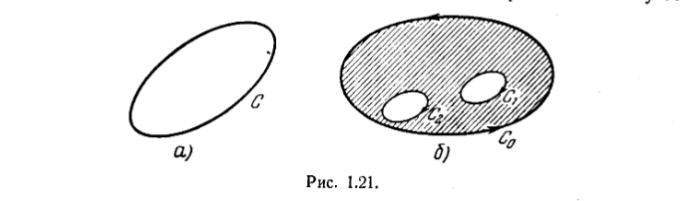

# Теорема Коши

Пусть функция f(z) голоморфна внутри некоторой области. Тогда криволинейный интеграл от этой функции по любому замкнутому контуру, расположенному внутри области, равен нулю 
(рис. 1.21 а)

Итак, требуется доказать, что 
$$
    \int_C f(z) dz = 0
$$

Применим, формулу (5) к замкноутому контуру C, ограничивающему область S. Вещественные интегралы, стоящие в правой части этой формулы, преобразуем по формуле Грина:
$$
    \int_C (P dy + Q dx) = \int_S \int (\frac{\partial P}{\partial x} - \frac{\partial Q}{\partial y}) dx dy, (6) \\ 

    \int_C (P dx - Q dy) = - \int_S \int (\frac{\partial Q}{\partial x} + \frac{\partial P}{\partial y}) dx dy. (7) 
$$

Для голоморфной функции f(z) выполняются условия Коши-Римана, т.е. оба выражения (6) и (7) равны нулю. Таким образом, теория Коши доказана.

*Замечание*. Доказанная теорема справедлива не только для простых контуров типа, изображенного на рис. 1.21. а. Она верна также в случае когда внутри области, ограниченной контуром $C_0$, имеются дырки, окруженные контурами $C_1$, $C_2$ и т.д. (см. рис 1.21б). В этом случае под контуром C в теореме Коши надо понимать сложный контур, состоящий из наружной кривой $C_0$, проходимой в положительном направлении(против часовой стрелки),и всех внутренних кривых $C_1,C_2$ и т.д., проходимых в отрицательном направлении (по часовой стрелке).

В случае голоморфности $f(z)$ интеграл (5) зависит только от положения начала и конца кривой C и не зависит от формы пути интегрирования. Для доказательства достаточно применить теорему Коши к замкнутому контуру C + C\`, где C\` - любая кривая, соединяющая концы кривой C.
*Замечание*. Вещественный криволинейный интеграл не зависит от формы пути, если он берется от функции, представляющей полный дифференциал. Условия Коши - Римана совпадают с условиями полного дифференциала для (5) .