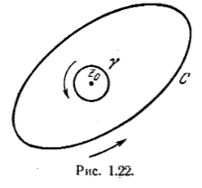

# Формула Коши

Пусть f(z) - функция, голоморфная в замкнутой области, ограниченной контуром C, а z_0 - внутренняя точка области рис.1.22

. Докажем что имеет место формула Коши
$$
    f(z_0) = \frac{1}{2 \pi j} \int \frac{f(z)}{z-z_0} dz (8)
$$
где контур C обходится в положительном направлении. Действительно, функция $\frac{f(z)}{z-z_0}, голоморфна во всех точках внутри контура, кроме точки $z = z_0$. Исключим из рассматриваемой области небольной круг с центром $z_0$ и радиусом p. Окружность его обозначим через $\gamma$ (см. рис. 1.22),

Функция $\frac{f(z)}{z-z_0}$ голоморфна внутри кольцевой области, органиченной C и $\gamma$,

Если перемещаться по C и по $\gamma$ в положительном направлении, то по теореме Коши
$$
    \int_C \frac{f(z)}{z-z_0}dz = \int_{\tau} \frac{f(z)}{z-z_0} dz.
$$

Интеграл слева не зависит от p. Следовательно, интеграл в правой части также не зависит от p.

    Имеем
$$
    \int_{\tau} \frac{f(z)}{z-z0}dz = \int_{\tau} \frac{f(z_0)dz}{z-z_0} + \int_{\tau} \frac{f(z) - f(z_0)}{z-z_0} dz.
$$

Первый интеграл справа вычисляем непосредственно:
$$
    \int_{\tau} \frac{f(z_0)dz}{z-z_0} = f(z_0) \int_{\tau} \frac{dz}{z-z_0} = f(z_0) \int_0^{2 \pi} \frac{jpe^{j \Theta} d \Theta}{pe^{j \Theta}} = 2 \pi j f(z_0).
$$

Так как f(z) непрерывна, то можно выбрать p настолько малым, что в круге внутри $\gamma$ |f(z)-f(z_0)| < \epsilon$, где $\epsilon$ - сколь угодно малое положительное число. Для этого значения p
$$
    | \int_{\tau} \frac{f(z) - f(z_0)}{z-z_0} dz | < \int_{\gamma} \frac{\epsilon | dz |}{|z - z_0|} = \int_{\gamma} \frac{\epsilon}{\p} dS = 2 \pi \epsilon
$$
так как путь интегрирования равен 2 \pi p. Это и доказывает формулу Коши(8).
Продифференцировав (8) n раз, получаем
$$
    f^{(n)}(z_0) = \frac{n!}{2\pi j} \int_C \frac{f(z) dz}{(z-z_0)^n+1} (9)
$$

