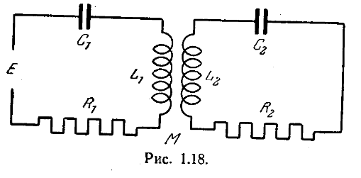

# Обобщение понятия комплексного полного сопроотивления.

Рассмотрим электрическую цепь самого общего вида, состоящую из n отдельных контуров. Оснановимся на контурах $l$ и $m$.

Пусть $L_11$, $R_11$, $C_11$ - самоиндукция, сопротивление и емкость, включенные последовательно в контур l: $L_{mm}$, $R_{mm}$ и $C_{mm}$ - те же величины для контура m.

Обозначим через $L_{im}=L_{mi}, $R_{lm} = R{ml}$, $C_{lm} = $C_{ml}$ самоиндукцию, сопротивление и емкость связи между двумя контурами l и m. Для обьяснения смысла этих величин рассмотрим цепь на рис. 1.17, состоящую из двух связанных контуров l и m. В этом примере мы имеем при выбранном для токов положительном направлении

$$
    L_{ll} = \Lambda_1 + \Lambda_2, L_{mm}=\Lambda_1 + \Lambda_2, L_{ml} = L_{lm} = M - \Lambda_2
$$

$$
    \frac{1}{C_{ll}} = \frac{1}{Г_1} + \frac{1}{Г_2},
    \frac{1}{C_mm} = \frac{1}{Г_1^`} + \frac{1}{Г_2}, \frac{1}{C_{ml}} = \frac{1}{C_{1m}} = - \frac{1}{Г_2} 
$$

$$
    R_{ll} = P_1 + P_2, R_{mm}=P^`_1 + P_2, R_{ml} + R_{lm} = -P_2
$$

Вернемся к изучению цели наиболее общего вида. Эта цепь описывается следующей системой дифференциальных уравнений:

$$
    \begin{cases}

        [L_{ 11 } \frac{ di_1 }{dt} + R_{ 11 } i_1 + \frac{ 1 }{ C_{11} } \int i_1 dt] + ... + [L_{1n} \frac{di_n}{dt} + R_{1n} i_n + \frac{1}{C_{1n}} \int i_n dt] = e_1 \\ 
        [L_{ nn } \frac{ di_n }{dt} + R_{ nn } i_1 + \frac{ 1 }{ C_{nn} } \int i_n dt] + ... + [L_{nn} \frac{di_n}{dt} + R_{nn} i_n + \frac{1}{C_{nn}} \int i_n dt] = e_n,
    \end{cases}
$$
где $e_1,e_2,....e_n$ обозначают электродвижушие силы, приложенные к рассматриваемым контурам.

Приложим к контуру l электродвижущую силу $e_l = E_1 e^{j \omega t}$. Электродвижущие силы, приложенные ко всем другим контурам цепи, будем считать равными нулю.

Если положить
$$
    l_k = G_k e^{j \omega t}, \\ 
    j \omega L_{1m} + R_{1m} + \frac{1}{j \omega C_{lm}} = z_{lm}(j \omega)
$$

то система приобретает такой вид
$$
    z_{11}(j \omega)G_1 + ... + z_{1n}(j \omega) g_n = 0 \\ 
    ....................................................
    z_{11}(j \omega) G_1 + ... + z_{ln}(j \omega) g_n = E_1, \\ 
    ....................................................
    z_{n1} (j \omega) G_1 + ... + z_{nn} (j \omega) g_n = 0.
$$

Обозначая через $D(j \omega)$ определитель системы, а через M_{lm}(j \omega) алгебраическое дополнение элемента $z_{lm}(j \omega), получаем
$$
    g_m = \frac{M_{lm}(j \omega)}{D(j \omega)} E_l
$$

Если положим

$$
    z_{lm}(j\omega) = \frac{D(j \omega)}{M_lm(j \omega)}
$$

то окончательно получим
$$
    E_l = Z_{lm}G_m\text{ или } E_le^{j \omega t} = Z_{lm} G_m e^{j \omega t}
$$

Величина $Z_{lm}(j \omega) называется эквивалентным полным сопротивлением цепи l по отношению к цепи m. Это - отношеение комплексного напряжения, приложенного к цепи l, и комплексному току, текущему по цепи m.

Величина, обратная эквивалентному полному сопротивлению, иногда называется коэффициентом изоморфного отклика цепи m по отнощению к цепи l. Мы определили, таким образом, комплексное полное сопротивление, которое позволяет связать синусоидальный ток, текущий по одному контуру, с синусоидальным возбуждением, возникающим в другом контуре, связанном с первым. На практике можно вычислить эквивалентное полное сопротивление, выписав систему канонических интегро-дифференциальных уравнений рассматриваемой цепи и заменяя в этой системе знак дифференцирования $\frac{d}{dt}$ на $j \omega$, а знак интегрирования на $\frac{1}{j \omega}. После этого остаётся решить систему полученных таким способом алгебраических уравнений.

Пример. Рассмотрим два связанных между собой контура изображённых на рис. 1.18. Приложим к левому контуру электродвижущую силу $E=e^{j \omega t}$. Дифференциальные уравнения системы принимают вид:
$$
    \begin{cases}
        L_1 \frac{di_1}{dt} + R_1l_1 + \frac{1}{C_1} \int i_1 dt + M \frac{di_2}{dt} = E.
        \\ 
        L_2 \frac{di_2}{dt} + R_2l_2 + \frac{1}{c_2} \int i_2 dt + M \frac{di_1}{dt} = 0
    \end{cases}
$$

Соответствующая алгебраическая система будет
$$
    \begin{cases}
        (j \omega L_1 + R_1 + \frac{1}{j \omega C_1}) i_1 + j \omega Mi_2 = 1, \\ 
        (j \omega L_2 + R_2 + \frac{1}{j \omega C_2}) i_2 + j \omega Mi_1 = 0, \\ 
    \end{cases}
$$

Определитель ее 
$$
    D(jw) = (j \omega L_1 + R_1 + \frac{1}{j \omega C_1})(j \omega L_2 + R_2 + \frac{1}{j \omega C_2}) + \omega ^2 M^2
$$

Алгебраические дополнения
$$
    M_{11}(j \omega) = j \omega L_2 + R_2 + \frac{1}{j \omega C_2},
    M_{12}(j \omega) = - j \omega M.
$$

откуда
$$
    \frac{1}{Z_{11} (j\omega)} = \frac{M_11 (j \omega)}{D(j \omega)} = \frac{j \omega L_2 + R_2 + \frac{1}{j    \omega C_2}}{D(j \omega)}
    \\ 
    \\ 
    \frac{1}{Z_{12}(j \omega)} = \frac{M_{12}(j \omega)}{D(j \omega)} = \frac{ -j \omega M}{D(j \omega)}
$$
